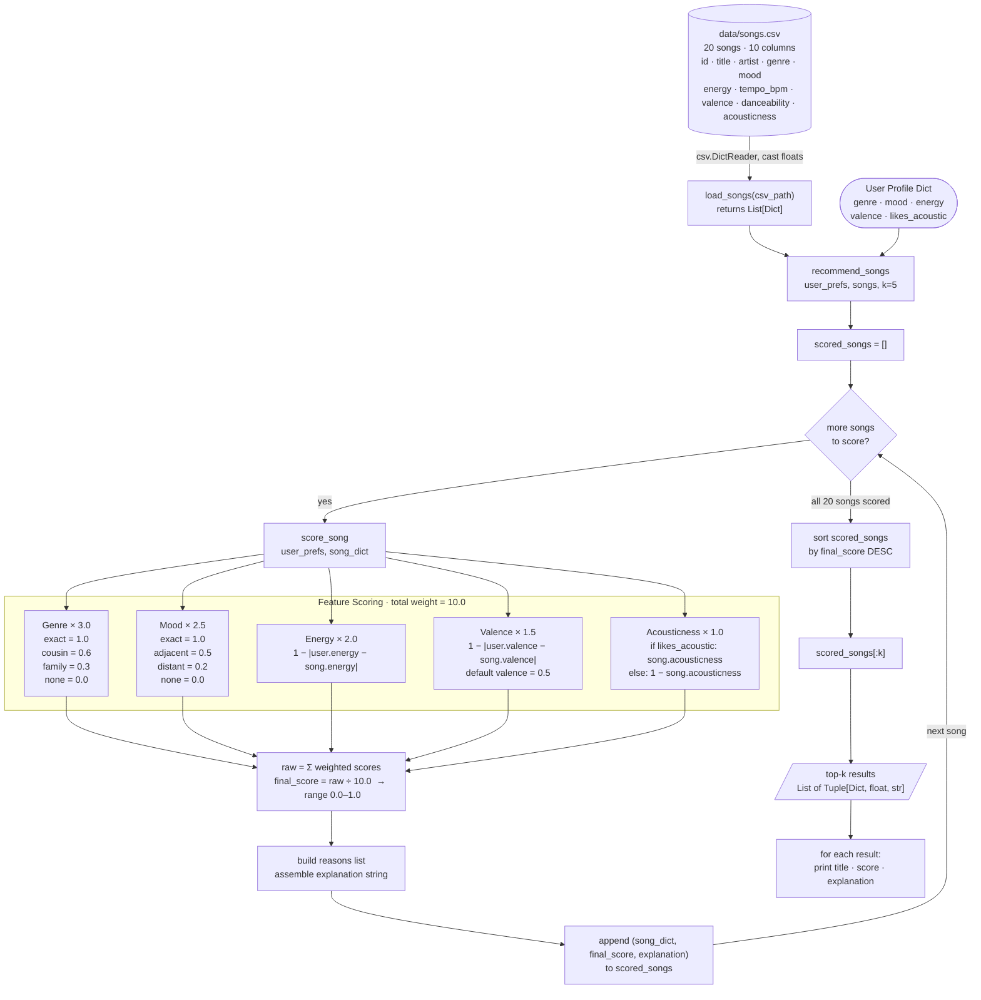
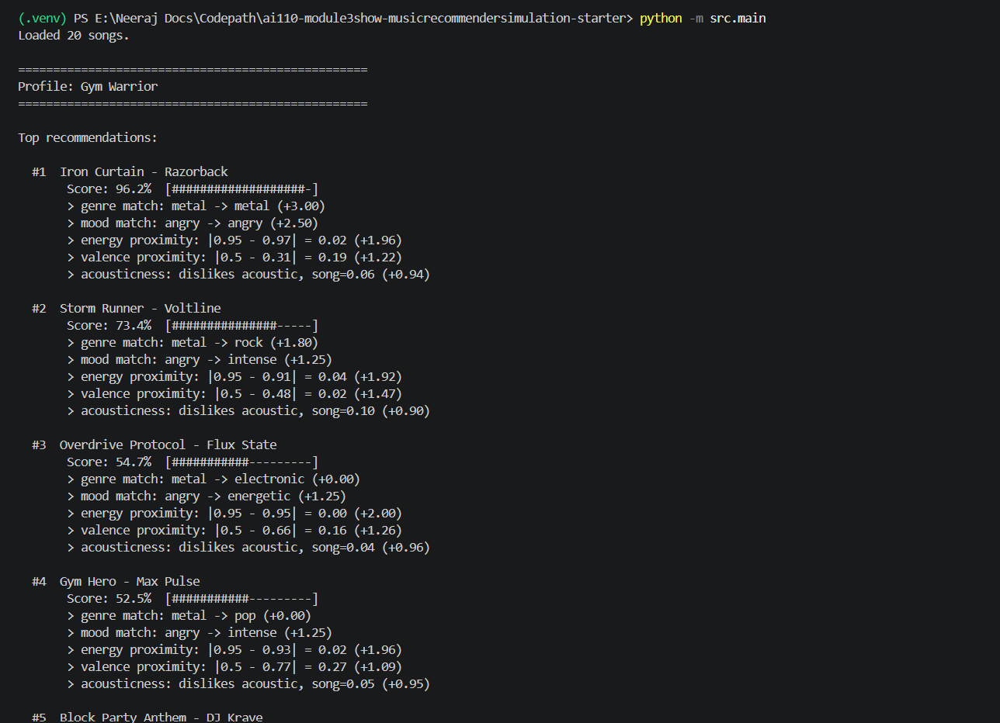
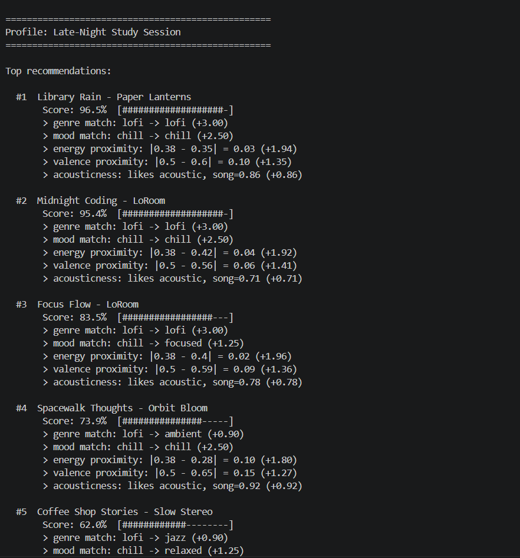
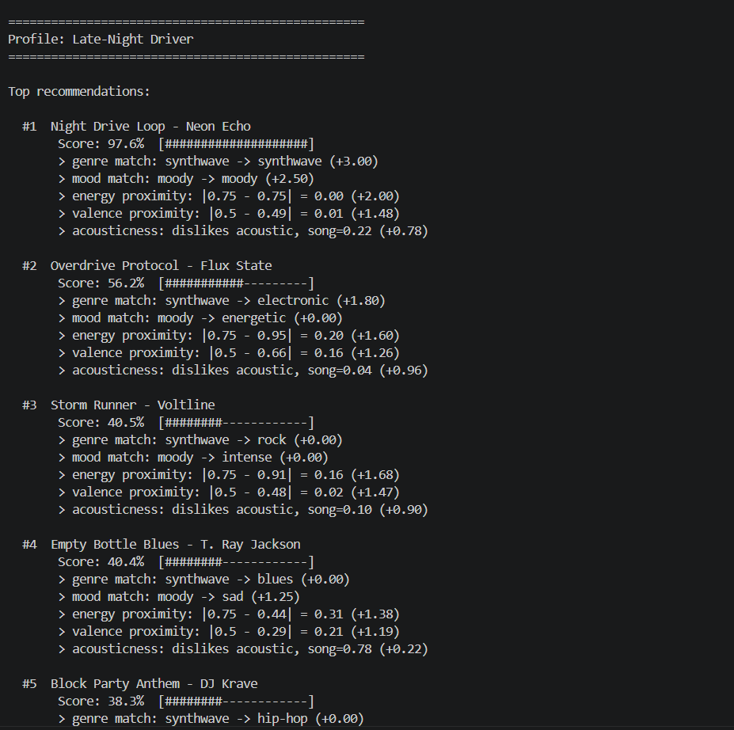
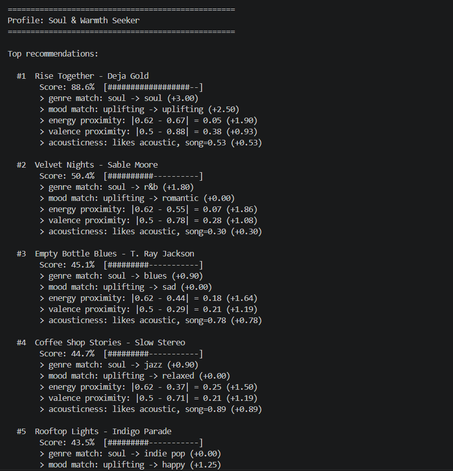
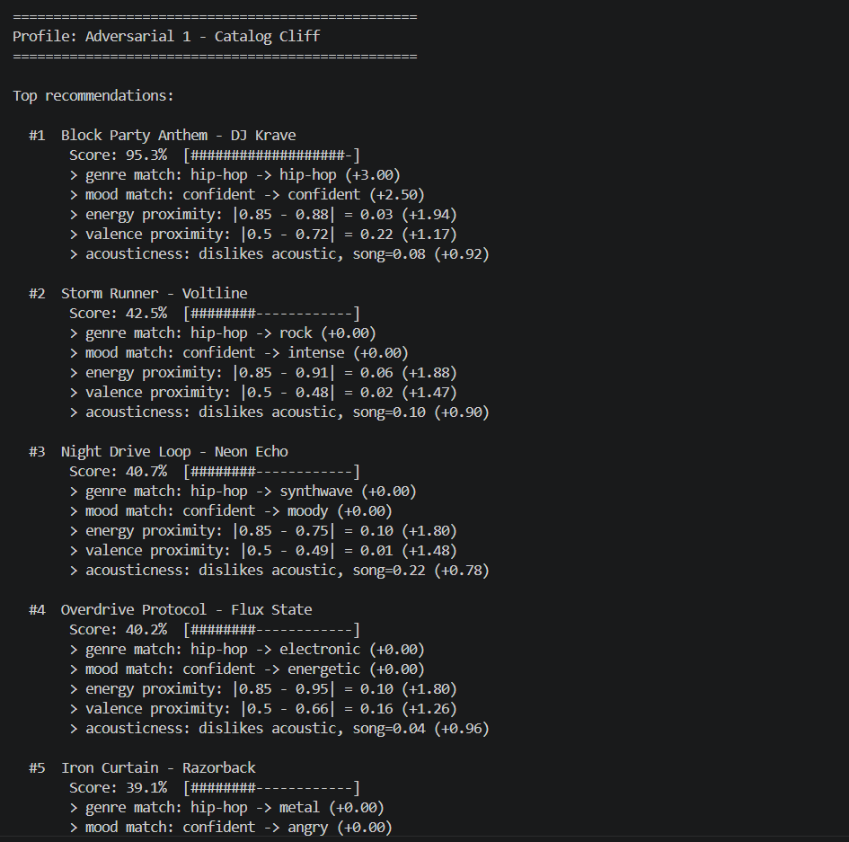
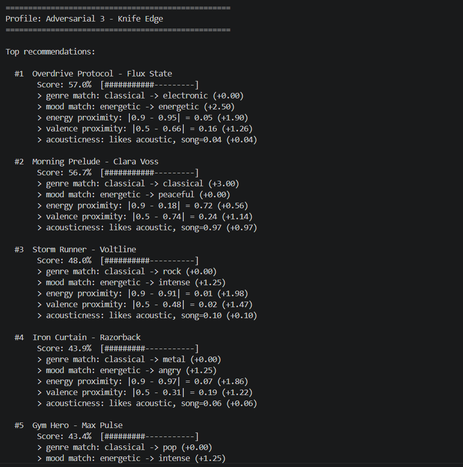

# 🎵 Music Recommender Simulation

## Project Summary

In this project you will build and explain a small music recommender system.

Your goal is to:

- Represent songs and a user "taste profile" as data
- Design a scoring rule that turns that data into recommendations
- Evaluate what your system gets right and wrong
- Reflect on how this mirrors real world AI recommenders

This project builds a small but complete music recommender simulation in Python. Given a user's taste profile — their preferred genre, mood, energy level, and sound texture preference — the system scores every song in a catalog and returns the best matches with an explanation of why each one fits. The goal isn't to build the next Spotify, but to understand the mechanics underneath it: how raw data about songs and users gets transformed into a ranked list of suggestions. Along the way the project also looks honestly at where simple systems like this fall short — the genres they ignore, the users they underserve, and the feedback loops they can accidentally create.

---

## How The System Works

Explain your design in plain language.

Some prompts to answer:

- What features does each `Song` use in your system
  - For example: genre, mood, energy, tempo
- What information does your `UserProfile` store
- How does your `Recommender` compute a score for each song
- How do you choose which songs to recommend

You can include a simple diagram or bullet list if helpful.

Real-world music recommenders like Spotify or YouTube don't just look at what genre you like — they combine hundreds of signals at once. They track what you skip, what you replay, what time of day you're listening, and even what other users with similar taste are enjoying. The result is a system that learns your preferences over time and gets smarter the more you use it.
My version is much simpler, but it captures the core idea. Instead of learning from behavior, it takes a snapshot of what a user says they want — their preferred genre, mood, energy level, and whether they like acoustic or produced sounds — and scores every song in the catalog against those preferences. It's transparent, predictable, and easy to reason about — which is exactly what makes it a good starting point for understanding how real recommenders think before all the complexity gets layered on.
Each Song in the system carries ten attributes pulled directly from the catalog: id, title, artist, genre, mood, energy, tempo_bpm, valence, danceability, and acousticness. The ones that do the most work in scoring are genre, mood, energy, valence, and acousticness — chosen because together they capture both the sonic character of a track and its emotional feel.
A UserProfile stores four preference inputs: a favorite_genre, a favorite_mood, a target_energy level between 0 and 1, and a likes_acoustic boolean that signals whether the user prefers organic or produced sounds.
The Recommender scores each song by comparing those preferences against the song's attributes using a weighted formula. Genre and mood are categorical matches — exact matches score highest, but neighboring genres and moods get partial credit so the system doesn't completely reject a song just because the label differs. Energy and valence use a proximity formula: 1.0 - |user_preference - song_value|, which rewards songs that are close to what the user wants rather than just high or low. Acousticness is handled as a directional preference — if the user likes acoustic sounds, higher acousticness scores better, and vice versa.
The weights reflect a deliberate hierarchy:

- Genre: 3.0 — defines the entire sonic world
- Mood: 2.5 — sets the emotional intent
- Energy: 2.0 — captures the physical feel
- Valence: 1.5 — fine-tunes emotional tone
- Acousticness: 1.0 — texture preference

Every song's weighted component scores are summed and divided by the total possible weight (10.0) to produce a final score between 0 and 1. Songs are then ranked by score and the top-k results are returned, each paired with a plain-language explanation of what made it a good match.

### Song Features

| Attribute | Type | Role |
| `genre` | string | Primary scoring feature — weight 3.0 |
| `mood` | string | Secondary scoring feature — weight 2.5 |
| `energy` | float 0–1 | Proximity scored — weight 2.0 |
| `valence` | float 0–1 | Proximity scored — weight 1.5 |
| `acousticness` | float 0–1 | Directional preference scored — weight 1.0 |
| `tempo_bpm` | float | Available but not scored in v1 |
| `danceability` | float 0–1 | Available but not scored in v1 |
| `title`, `artist`, `id` | — | Display only, not scored |

### UserProfile Features

| Attribute | Type | What it represents |
| `favorite_genre` | string | Matched against song genre |
| `favorite_mood` | string | Matched against song mood |
| `target_energy` | float 0–1 | Ideal energy level — proximity scored |
| `likes_acoustic` | boolean | True = prefers acoustic, False = prefers produced |

### Algorithm Recipe

The recommender scores each song by running it through five feature checks and adding up the weighted results.

**Genre (weight 3.0):** An exact match scores 1.0. If the song's genre is in the same broader family — say, hip-hop when the user asked for rap — it scores 0.6. A more distant but still related genre scores 0.3. No connection at all scores 0.0.

**Mood (weight 2.5):** Exact match scores 1.0. An adjacent mood — something like "melancholy" when the user said "sad" — scores 0.5. A loosely related mood scores 0.2. Unrelated moods score 0.0.

**Energy (weight 2.0):** Scored by proximity: `1.0 - |user.target_energy - song.energy|`. A song that perfectly matches the user's energy level scores 1.0; the further away it lands, the lower the score.

**Valence (weight 1.5):** Same proximity formula as energy: `1.0 - |user.valence - song.valence|`. If the user hasn't specified a valence preference, the song's value is compared against a neutral default of 0.5.

**Acousticness (weight 1.0):** Directional rather than proximity-based. If the user likes acoustic sounds, the song's raw acousticness value is used as-is. If they prefer produced sounds, the score is flipped: `1.0 - song.acousticness`.

The five weighted scores are summed and divided by 10.0 — the total possible weight — producing a final score between 0 and 1. Songs are ranked by this score, and the top-k are returned with a plain-language explanation of what made each one a good match.

### Known Biases and Limitations

- **Genre dominates everything.** With a weight of 3.0 — triple that of acousticness — a song in the wrong genre can barely compete no matter how well it matches on energy, mood, or texture. A jazz fan will almost never see a soul track in their recommendations even if the two share identical character.
- **Most genres have thin catalog coverage.** The 20-song catalog concentrates in a handful of genres, so users who prefer less-represented styles like classical or reggae will hit a ceiling of good matches quickly and may receive off-genre recommendations simply because there's nothing closer in stock.
- **No behavioral learning.** The system only knows what users say they want, not what they actually listen to. It can't correct itself when stated preference and real preference diverge, and it won't pick up on shifts in taste over time the way a streaming platform would.
- **Filter bubble risk.** Heavy weighting toward exact or near matches means the same cluster of songs tends to surface for similar user profiles. Users are never nudged toward music outside their stated preferences, which can reinforce existing taste rather than broaden it.
- **Valence is often a guess.** If the user doesn't provide a valence preference, the system quietly defaults to 0.5 — neutral — which disadvantages both very uplifting and very somber tracks even when the user might have loved them.

---

## Data Flow



---

## Getting Started

### Setup

1. Create a virtual environment (optional but recommended):

   ```bash
   python -m venv .venv
   source .venv/bin/activate      # Mac or Linux
   .venv\Scripts\activate         # Windows

2. Install dependencies

```bash
pip install -r requirements.txt
```

3. Run the app:

```bash
python -m src.main
```

### Running Tests

Run the starter tests with:

```bash
pytest
```

You can add more tests in `tests/test_recommender.py`.

---

## Sample Output

Running `python -m src.main` with the **Gym Warrior** profile (genre: metal, mood: angry, energy: 0.95, likes_acoustic: False):



```
==================================================
Profile: Gym Warrior
==================================================

Top recommendations:

  #1  Iron Curtain - Razorback
       Score: 96.2%  [###################-]
       > genre match: metal -> metal (+3.00)
       > mood match: angry -> angry (+2.50)
       > energy proximity: |0.95 - 0.97| = 0.02 (+1.96)
       > valence proximity: |0.5 - 0.31| = 0.19 (+1.22)
       > acousticness: dislikes acoustic, song=0.06 (+0.94)

  #2  Storm Runner - Voltline
       Score: 73.4%  [###############-----]
       > genre match: metal -> rock (+1.80)
       > mood match: angry -> intense (+1.25)
       > energy proximity: |0.95 - 0.91| = 0.04 (+1.92)
       > valence proximity: |0.5 - 0.48| = 0.02 (+1.47)
       > acousticness: dislikes acoustic, song=0.10 (+0.90)

  #3  Overdrive Protocol - Flux State
       Score: 54.7%  [###########---------]
       > genre match: metal -> electronic (+0.00)
       > mood match: angry -> energetic (+1.25)
       > energy proximity: |0.95 - 0.95| = 0.00 (+2.00)
       > valence proximity: |0.5 - 0.66| = 0.16 (+1.26)
       > acousticness: dislikes acoustic, song=0.04 (+0.96)

  #4  Gym Hero - Max Pulse
       Score: 52.5%  [###########---------]
       > genre match: metal -> pop (+0.00)
       > mood match: angry -> intense (+1.25)
       > energy proximity: |0.95 - 0.93| = 0.02 (+1.96)
       > valence proximity: |0.5 - 0.77| = 0.27 (+1.09)
       > acousticness: dislikes acoustic, song=0.05 (+0.95)

  #5  Block Party Anthem - DJ Krave
       Score: 39.5%  [########------------]
       > genre match: metal -> hip-hop (+0.00)
       > mood match: angry -> confident (+0.00)
       > energy proximity: |0.95 - 0.88| = 0.07 (+1.86)
       > valence proximity: |0.5 - 0.72| = 0.22 (+1.17)
       > acousticness: dislikes acoustic, song=0.08 (+0.92)
```

### Late-Night Study Session

Running `python -m src.main` with the **Late-Night Study Session** profile (genre: lofi, mood: chill, energy: 0.38, likes_acoustic: True):



```
==================================================
Profile: Late-Night Study Session
==================================================

Top recommendations:

  #1  Library Rain - Paper Lanterns
       Score: 96.5%  [###################-]
       > genre match: lofi -> lofi (+3.00)
       > mood match: chill -> chill (+2.50)
       > energy proximity: |0.38 - 0.35| = 0.03 (+1.94)
       > valence proximity: |0.5 - 0.6| = 0.10 (+1.35)
       > acousticness: likes acoustic, song=0.86 (+0.86)

  #2  Midnight Coding - LoRoom
       Score: 95.4%  [###################-]
       > genre match: lofi -> lofi (+3.00)
       > mood match: chill -> chill (+2.50)
       > energy proximity: |0.38 - 0.42| = 0.04 (+1.92)
       > valence proximity: |0.5 - 0.56| = 0.06 (+1.41)
       > acousticness: likes acoustic, song=0.71 (+0.71)

  #3  Focus Flow - LoRoom
       Score: 83.5%  [#################---]
       > genre match: lofi -> lofi (+3.00)
       > mood match: chill -> focused (+1.25)
       > energy proximity: |0.38 - 0.4| = 0.02 (+1.96)
       > valence proximity: |0.5 - 0.59| = 0.09 (+1.36)
       > acousticness: likes acoustic, song=0.78 (+0.78)

  #4  Spacewalk Thoughts - Orbit Bloom
       Score: 73.9%  [###############-----]
       > genre match: lofi -> ambient (+0.90)
       > mood match: chill -> chill (+2.50)
       > energy proximity: |0.38 - 0.28| = 0.10 (+1.80)
       > valence proximity: |0.5 - 0.65| = 0.15 (+1.27)
       > acousticness: likes acoustic, song=0.92 (+0.92)

  #5  Coffee Shop Stories - Slow Stereo
       Score: 62.0%  [############--------]
       > genre match: lofi -> jazz (+0.90)
       > mood match: chill -> relaxed (+1.25)
       > energy proximity: |0.38 - 0.37| = 0.01 (+1.98)
       > valence proximity: |0.5 - 0.71| = 0.21 (+1.19)
       > acousticness: likes acoustic, song=0.89 (+0.89)
```

### Late-Night Driver

Running `python -m src.main` with the **Late-Night Driver** profile (genre: synthwave, mood: moody, energy: 0.75, likes_acoustic: False):



```
==================================================
Profile: Late-Night Driver
==================================================

Top recommendations:

  #1  Night Drive Loop - Neon Echo
       Score: 97.6%  [####################]
       > genre match: synthwave -> synthwave (+3.00)
       > mood match: moody -> moody (+2.50)
       > energy proximity: |0.75 - 0.75| = 0.00 (+2.00)
       > valence proximity: |0.5 - 0.49| = 0.01 (+1.48)
       > acousticness: dislikes acoustic, song=0.22 (+0.78)

  #2  Overdrive Protocol - Flux State
       Score: 56.2%  [###########---------]
       > genre match: synthwave -> electronic (+1.80)
       > mood match: moody -> energetic (+0.00)
       > energy proximity: |0.75 - 0.95| = 0.20 (+1.60)
       > valence proximity: |0.5 - 0.66| = 0.16 (+1.26)
       > acousticness: dislikes acoustic, song=0.04 (+0.96)

  #3  Storm Runner - Voltline
       Score: 40.5%  [########------------]
       > genre match: synthwave -> rock (+0.00)
       > mood match: moody -> intense (+0.00)
       > energy proximity: |0.75 - 0.91| = 0.16 (+1.68)
       > valence proximity: |0.5 - 0.48| = 0.02 (+1.47)
       > acousticness: dislikes acoustic, song=0.10 (+0.90)

  #4  Empty Bottle Blues - T. Ray Jackson
       Score: 40.4%  [########------------]
       > genre match: synthwave -> blues (+0.00)
       > mood match: moody -> sad (+1.25)
       > energy proximity: |0.75 - 0.44| = 0.31 (+1.38)
       > valence proximity: |0.5 - 0.29| = 0.21 (+1.19)
       > acousticness: dislikes acoustic, song=0.78 (+0.22)

  #5  Block Party Anthem - DJ Krave
       Score: 38.3%  [########------------]
       > genre match: synthwave -> hip-hop (+0.00)
       > mood match: moody -> confident (+0.00)
       > energy proximity: |0.75 - 0.88| = 0.13 (+1.74)
       > valence proximity: |0.5 - 0.72| = 0.22 (+1.17)
       > acousticness: dislikes acoustic, song=0.08 (+0.92)
```

### Soul & Warmth Seeker

Running `python -m src.main` with the **Soul & Warmth Seeker** profile (genre: soul, mood: uplifting, energy: 0.62, likes_acoustic: True):



```
==================================================
Profile: Soul & Warmth Seeker
==================================================

Top recommendations:

  #1  Rise Together - Deja Gold
       Score: 88.6%  [##################--]
       > genre match: soul -> soul (+3.00)
       > mood match: uplifting -> uplifting (+2.50)
       > energy proximity: |0.62 - 0.67| = 0.05 (+1.90)
       > valence proximity: |0.5 - 0.88| = 0.38 (+0.93)
       > acousticness: likes acoustic, song=0.53 (+0.53)

  #2  Velvet Nights - Sable Moore
       Score: 50.4%  [##########----------]
       > genre match: soul -> r&b (+1.80)
       > mood match: uplifting -> romantic (+0.00)
       > energy proximity: |0.62 - 0.55| = 0.07 (+1.86)
       > valence proximity: |0.5 - 0.78| = 0.28 (+1.08)
       > acousticness: likes acoustic, song=0.30 (+0.30)

  #3  Empty Bottle Blues - T. Ray Jackson
       Score: 45.1%  [#########-----------]
       > genre match: soul -> blues (+0.90)
       > mood match: uplifting -> sad (+0.00)
       > energy proximity: |0.62 - 0.44| = 0.18 (+1.64)
       > valence proximity: |0.5 - 0.29| = 0.21 (+1.19)
       > acousticness: likes acoustic, song=0.78 (+0.78)

  #4  Coffee Shop Stories - Slow Stereo
       Score: 44.7%  [#########-----------]
       > genre match: soul -> jazz (+0.90)
       > mood match: uplifting -> relaxed (+0.00)
       > energy proximity: |0.62 - 0.37| = 0.25 (+1.50)
       > valence proximity: |0.5 - 0.71| = 0.21 (+1.19)
       > acousticness: likes acoustic, song=0.89 (+0.89)

  #5  Rooftop Lights - Indigo Parade
       Score: 43.5%  [#########-----------]
       > genre match: soul -> indie pop (+0.00)
       > mood match: uplifting -> happy (+1.25)
       > energy proximity: |0.62 - 0.76| = 0.14 (+1.72)
       > valence proximity: |0.5 - 0.81| = 0.31 (+1.03)
       > acousticness: likes acoustic, song=0.35 (+0.35)
```

### Adversarial Profiles

Three profiles designed to expose weaknesses in the scoring algorithm: a double-isolated genre/mood node, a mood-overrides-genre inversion, and a knife-edge contradiction where opposing features cancel out.






```
==================================================
Profile: Adversarial 1 - Catalog Cliff
==================================================

Top recommendations:

  #1  Block Party Anthem - DJ Krave
       Score: 95.3%  [###################-]
       > genre match: hip-hop -> hip-hop (+3.00)
       > mood match: confident -> confident (+2.50)
       > energy proximity: |0.85 - 0.88| = 0.03 (+1.94)
       > valence proximity: |0.5 - 0.72| = 0.22 (+1.17)
       > acousticness: dislikes acoustic, song=0.08 (+0.92)

  #2  Storm Runner - Voltline
       Score: 42.5%  [########------------]
       > genre match: hip-hop -> rock (+0.00)
       > mood match: confident -> intense (+0.00)
       > energy proximity: |0.85 - 0.91| = 0.06 (+1.88)
       > valence proximity: |0.5 - 0.48| = 0.02 (+1.47)
       > acousticness: dislikes acoustic, song=0.10 (+0.90)

  #3  Night Drive Loop - Neon Echo
       Score: 40.7%  [########------------]
       > genre match: hip-hop -> synthwave (+0.00)
       > mood match: confident -> moody (+0.00)
       > energy proximity: |0.85 - 0.75| = 0.10 (+1.80)
       > valence proximity: |0.5 - 0.49| = 0.01 (+1.48)
       > acousticness: dislikes acoustic, song=0.22 (+0.78)

  #4  Overdrive Protocol - Flux State
       Score: 40.2%  [########------------]
       > genre match: hip-hop -> electronic (+0.00)
       > mood match: confident -> energetic (+0.00)
       > energy proximity: |0.85 - 0.95| = 0.10 (+1.80)
       > valence proximity: |0.5 - 0.66| = 0.16 (+1.26)
       > acousticness: dislikes acoustic, song=0.04 (+0.96)

  #5  Iron Curtain - Razorback
       Score: 39.1%  [########------------]
       > genre match: hip-hop -> metal (+0.00)
       > mood match: confident -> angry (+0.00)
       > energy proximity: |0.85 - 0.97| = 0.12 (+1.76)
       > valence proximity: |0.5 - 0.31| = 0.19 (+1.22)
       > acousticness: dislikes acoustic, song=0.06 (+0.94)

==================================================
Profile: Adversarial 2 - Mood Override
==================================================

Top recommendations:

  #1  Overdrive Protocol - Flux State
       Score: 66.6%  [#############-------]
       > genre match: reggae -> electronic (+0.00)
       > mood match: energetic -> energetic (+2.50)
       > energy proximity: |0.92 - 0.95| = 0.03 (+1.94)
       > valence proximity: |0.5 - 0.66| = 0.16 (+1.26)
       > acousticness: dislikes acoustic, song=0.04 (+0.96)

  #2  Island Time - Coral Roots
       Score: 56.7%  [###########---------]
       > genre match: reggae -> reggae (+3.00)
       > mood match: energetic -> relaxed (+0.00)
       > energy proximity: |0.92 - 0.52| = 0.40 (+1.20)
       > valence proximity: |0.5 - 0.82| = 0.32 (+1.02)
       > acousticness: dislikes acoustic, song=0.55 (+0.45)

  #3  Storm Runner - Voltline
       Score: 56.0%  [###########---------]
       > genre match: reggae -> rock (+0.00)
       > mood match: energetic -> intense (+1.25)
       > energy proximity: |0.92 - 0.91| = 0.01 (+1.98)
       > valence proximity: |0.5 - 0.48| = 0.02 (+1.47)
       > acousticness: dislikes acoustic, song=0.10 (+0.90)

  #4  Iron Curtain - Razorback
       Score: 53.0%  [###########---------]
       > genre match: reggae -> metal (+0.00)
       > mood match: energetic -> angry (+1.25)
       > energy proximity: |0.92 - 0.97| = 0.05 (+1.90)
       > valence proximity: |0.5 - 0.31| = 0.19 (+1.22)
       > acousticness: dislikes acoustic, song=0.06 (+0.94)

  #5  Gym Hero - Max Pulse
       Score: 52.8%  [###########---------]
       > genre match: reggae -> pop (+0.00)
       > mood match: energetic -> intense (+1.25)
       > energy proximity: |0.92 - 0.93| = 0.01 (+1.98)
       > valence proximity: |0.5 - 0.77| = 0.27 (+1.09)
       > acousticness: dislikes acoustic, song=0.05 (+0.95)

==================================================
Profile: Adversarial 3 - Knife Edge
==================================================

Top recommendations:

  #1  Overdrive Protocol - Flux State
       Score: 57.0%  [###########---------]
       > genre match: classical -> electronic (+0.00)
       > mood match: energetic -> energetic (+2.50)
       > energy proximity: |0.9 - 0.95| = 0.05 (+1.90)
       > valence proximity: |0.5 - 0.66| = 0.16 (+1.26)
       > acousticness: likes acoustic, song=0.04 (+0.04)

  #2  Morning Prelude - Clara Voss
       Score: 56.7%  [###########---------]
       > genre match: classical -> classical (+3.00)
       > mood match: energetic -> peaceful (+0.00)
       > energy proximity: |0.9 - 0.18| = 0.72 (+0.56)
       > valence proximity: |0.5 - 0.74| = 0.24 (+1.14)
       > acousticness: likes acoustic, song=0.97 (+0.97)

  #3  Storm Runner - Voltline
       Score: 48.0%  [##########----------]
       > genre match: classical -> rock (+0.00)
       > mood match: energetic -> intense (+1.25)
       > energy proximity: |0.9 - 0.91| = 0.01 (+1.98)
       > valence proximity: |0.5 - 0.48| = 0.02 (+1.47)
       > acousticness: likes acoustic, song=0.10 (+0.10)

  #4  Iron Curtain - Razorback
       Score: 43.9%  [#########-----------]
       > genre match: classical -> metal (+0.00)
       > mood match: energetic -> angry (+1.25)
       > energy proximity: |0.9 - 0.97| = 0.07 (+1.86)
       > valence proximity: |0.5 - 0.31| = 0.19 (+1.22)
       > acousticness: likes acoustic, song=0.06 (+0.06)

  #5  Gym Hero - Max Pulse
       Score: 43.4%  [#########-----------]
       > genre match: classical -> pop (+0.00)
       > mood match: energetic -> intense (+1.25)
       > energy proximity: |0.9 - 0.93| = 0.03 (+1.94)
       > valence proximity: |0.5 - 0.77| = 0.27 (+1.09)
       > acousticness: likes acoustic, song=0.05 (+0.05)
```

---

## Experiments You Tried

Use this section to document the experiments you ran. For example:

- What happened when you changed the weight on genre from 2.0 to 0.5
- What happened when you added tempo or valence to the score
- How did your system behave for different types of users

---

## Limitations and Risks

Summarize some limitations of your recommender.

Examples:

- It only works on a tiny catalog
- It does not understand lyrics or language
- It might over favor one genre or mood

You will go deeper on this in your model card.

---

## Reflection

Read and complete `model_card.md`:

[**Model Card**](model_card.md)

Write 1 to 2 paragraphs here about what you learned:

- about how recommenders turn data into predictions
- about where bias or unfairness could show up in systems like this


---

## 7. `model_card_template.md`

Combines reflection and model card framing from the Module 3 guidance. :contentReference[oaicite:2]{index=2}  

```markdown
# 🎧 Model Card - Music Recommender Simulation

## 1. Model Name

Give your recommender a name, for example:

> VibeFinder 1.0

---

## 2. Intended Use

- What is this system trying to do
- Who is it for

Example:

> This model suggests 3 to 5 songs from a small catalog based on a user's preferred genre, mood, and energy level. It is for classroom exploration only, not for real users.

---

## 3. How It Works (Short Explanation)

Describe your scoring logic in plain language.

- What features of each song does it consider
- What information about the user does it use
- How does it turn those into a number

Try to avoid code in this section, treat it like an explanation to a non programmer.

---

## 4. Data

Describe your dataset.

- How many songs are in `data/songs.csv`
- Did you add or remove any songs
- What kinds of genres or moods are represented
- Whose taste does this data mostly reflect

---

## 5. Strengths

Where does your recommender work well

You can think about:
- Situations where the top results "felt right"
- Particular user profiles it served well
- Simplicity or transparency benefits

---

## 6. Limitations and Bias

Where does your recommender struggle

Some prompts:
- Does it ignore some genres or moods
- Does it treat all users as if they have the same taste shape
- Is it biased toward high energy or one genre by default
- How could this be unfair if used in a real product

---

## 7. Evaluation

How did you check your system

Examples:
- You tried multiple user profiles and wrote down whether the results matched your expectations
- You compared your simulation to what a real app like Spotify or YouTube tends to recommend
- You wrote tests for your scoring logic

You do not need a numeric metric, but if you used one, explain what it measures.

---

## 8. Future Work

If you had more time, how would you improve this recommender

Examples:

- Add support for multiple users and "group vibe" recommendations
- Balance diversity of songs instead of always picking the closest match
- Use more features, like tempo ranges or lyric themes

---

## 9. Personal Reflection

A few sentences about what you learned:

- What surprised you about how your system behaved
- How did building this change how you think about real music recommenders
- Where do you think human judgment still matters, even if the model seems "smart"

